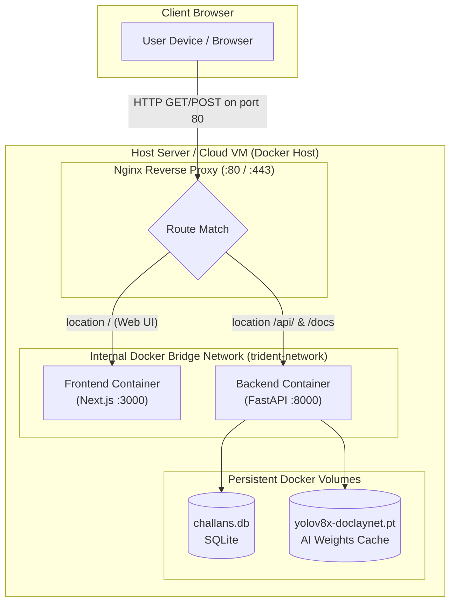

# 🚀 Trident Enterprise Deployment Guide (Jenkins CI/CD & Zero-CORS Architecture)

This document provides a comprehensive, production-grade guide for deploying **Trident OCR & Document Intelligence Pipeline** using **Jenkins CI/CD**, **Docker**, and **Nginx**.

It includes an in-depth breakdown of the **Zero-CORS Architecture**, environment secrets handling, database persistence, and automated health verification.

---

## 📑 Table of Contents

1. [Architectural Overview & The Zero-CORS Blueprint](#1-architectural-overview--the-zero-cors-blueprint)
2. [Why CORS Errors Occur & How We Eliminate Them 100%](#2-why-cors-errors-occur--how-we-eliminate-them-100)
3. [Server & Infrastructure Prerequisites](#3-server--infrastructure-prerequisites)
4. [Step-by-Step Jenkins Configuration](#4-step-by-step-jenkins-configuration)
   - [4.1 Required Jenkins Plugins](#41-required-jenkins-plugins)
   - [4.2 Configuring Jenkins Secrets & Credentials](#42-configuring-jenkins-secrets--credentials)
   - [4.3 Configuring the Jenkins Pipeline Job](#43-configuring-the-jenkins-pipeline-job)
5. [Configuration & Deployment Files Breakdown](#5-configuration--deployment-files-breakdown)
   - [5.1 `Jenkinsfile` (Declarative CI/CD Pipeline)](#51-jenkinsfile-declarative-cicd-pipeline)
   - [5.2 `docker-compose.yml` (Service Orchestration)](#52-docker-composeyml-service-orchestration)
   - [5.3 `nginx/nginx.conf` (Zero-CORS Gateway)](#53-nginxnginxconf-zero-cors-gateway)
   - [5.4 `backend/Dockerfile` & `frontend/Dockerfile`](#54-backenddockerfile--frontenddockerfile)
6. [Environment Variables Reference](#6-environment-variables-reference)
7. [Running the Deployment (Triggering Jenkins)](#7-running-the-deployment-triggering-jenkins)
8. [Zero-CORS Verification & Smoke Testing](#8-zero-cors-verification--smoke-testing)
9. [Troubleshooting & Maintenance Matrix](#9-troubleshooting--maintenance-matrix)

---

## 1. Architectural Overview & The Zero-CORS Blueprint

Trident consists of two primary services:
1. **Frontend**: Next.js 14 Web Application (Port 3000)
2. **Backend**: FastAPI Python Intelligence Engine with Layout Analysis & VLM (Port 8000)

In a typical multi-container deployment, having the browser connect to `http://host:3000` for HTML/JS and separately to `http://host:8000` for API calls triggers Cross-Origin Resource Sharing (CORS) preflight checks, which often fail due to mismatched hostnames, missing headers, or restrictive browser security policies.

### 🛡️ Production Single-Origin Architecture (Zero-CORS Gateway)



---

## 2. Why CORS Errors Occur & How We Eliminate Them 100%

### What causes CORS errors in production?
1. **Different Origins**: The browser accesses the frontend on `http://your-server-ip:3000` and tries to fetch `http://your-server-ip:8000`. Because the ports differ (3000 vs 8000), the browser treats this as a cross-origin request.
2. **Missing Preflight Responses**: For complex requests (`POST` with `multipart/form-data` or custom `Authorization` headers), the browser sends an `OPTIONS` preflight request. If the backend fails to respond with matching `Access-Control-Allow-Origin`, `Access-Control-Allow-Methods`, or `Access-Control-Allow-Headers`, the request is blocked before reaching the application.
3. **Hardcoded Localhost**: If the Next.js bundle is built with `NEXT_PUBLIC_API_URL=http://localhost:8000`, users accessing the app from another computer will send requests to *their own local machine* rather than the server.

### How Trident Solves This (Dual-Shield Protection):

1. **Shield 1 — Single-Origin Gateway (Nginx Reverse Proxy)**:
   - Nginx serves both the frontend (`/`) and the API (`/api/`) on the **same port (80 or 443)**.
   - The frontend requests `/api/v1/...` relatively.
   - Because the origin (`http://your-server/`) is identical for both static assets and API calls, **the browser's Same-Origin Policy is fully satisfied, completely bypassing CORS**.

2. **Shield 2 — Resilient FastAPI CORS Middleware**:
   - `backend/main.py` is configured with `allow_origin_regex=r"https?://.*"`, dynamic origin detection, and full headers/methods support.
   - Even if you access the backend directly on port 8000 from any domain or IP, the preflight `OPTIONS` handshake succeeds immediately.

3. **Shield 3 — Built-in Nginx Fallback Handshake**:
   - In `nginx/nginx.conf`, any incoming `OPTIONS` preflight request to `/api/` is automatically intercepted and returned with `HTTP 204 No Content` and full `Access-Control-Allow-*` headers.

---

## 3. Server & Infrastructure Prerequisites

Ensure your target server (or Jenkins build agent) satisfies the following specifications:

| Requirement | Minimum Specification | Recommended Specification |
| :--- | :--- | :--- |
| **Operating System** | Ubuntu 22.04 LTS / Debian 12 / RHEL 9 | Ubuntu 22.04 LTS |
| **CPU** | 2 vCPUs | 4+ vCPUs |
| **Memory (RAM)** | 4 GB | 8 GB+ (for layout detection & PyTorch) |
| **Disk Space** | 20 GB free | 50 GB+ SSD |
| **Docker Engine** | Version 24.0 or higher | Latest stable Docker CE |
| **Docker Compose** | Docker Compose v2 (`docker compose`) | Latest v2.x |
| **Inbound Ports** | Port 80 (HTTP), Port 443 (HTTPS) | Port 80, 443, 8080 (Jenkins) |

### Installing Docker & Docker Compose on Target Host (Ubuntu/Debian):

```bash
# Update package list and install prerequisites
sudo apt-get update
sudo apt-get install -y ca-certificates curl gnupg lsb-release

# Add Docker's official GPG key
sudo install -m 0755 -d /etc/apt/keyrings
curl -fsSL https://download.docker.com/linux/ubuntu/gpg | sudo gpg --dearmor -o /etc/apt/keyrings/docker.gpg
sudo chmod a+r /etc/apt/keyrings/docker.gpg

# Set up repository
echo \
  "deb [arch="$(dpkg --print-architecture)" signed-by=/etc/apt/keyrings/docker.gpg] https://download.docker.com/linux/ubuntu \
  "$(. /etc/os-release && echo "$VERSION_CODENAME")" stable" | \
  sudo tee /etc/apt/sources.list.d/docker.list > /dev/null

# Install Docker Engine & Compose plugin
sudo apt-get update
sudo apt-get install -y docker-ce docker-ce-cli containerd.io docker-buildx-plugin docker-compose-plugin

# Add jenkins user to docker group (CRITICAL for Jenkins permission)
sudo usermod -aG docker jenkins
sudo systemctl restart docker
```

---

## 4. Step-by-Step Jenkins Configuration

### 4.1 Required Jenkins Plugins

Open your Jenkins Dashboard (`http://your-jenkins-ip:8080`) and navigate to:
**Manage Jenkins** ➔ **Plugins** ➔ **Available Plugins**

Install the following plugins:
- ✅ **Pipeline** (`workflow-aggregator`)
- ✅ **Docker Pipeline** (`docker-workflow`)
- ✅ **Credentials Binding Plugin** (`credentials-binding`)
- ✅ **Git Plugin** (`git`)
- ✅ **AnsiColor** (`ansicolor` — for colored terminal output)

---

### 4.2 Configuring Jenkins Secrets & Credentials

To prevent sensitive AI API keys from being committed to Git or exposed in build logs, store them in Jenkins Credentials Manager:

1. Navigate to: **Manage Jenkins** ➔ **Credentials** ➔ **System** ➔ **Global credentials (unrestricted)**.
2. Click **Add Credentials**.
3. Create the **OpenAI Key**:
   - **Kind**: `Secret text`
   - **Scope**: `Global`
   - **Secret**: `sk-your-openai-api-key-here...`
   - **ID**: `trident-openai-api-key` *(Must match the ID used in Jenkinsfile)*
   - **Description**: `Trident OpenAI API Key for GPT-4o / GPT-5 VLM`
   - Click **Create**.
4. Click **Add Credentials** again to create the **Google Gemini Key**:
   - **Kind**: `Secret text`
   - **Scope**: `Global`
   - **Secret**: `AIza-your-gemini-api-key-here...`
   - **ID**: `trident-google-api-key` *(Must match the ID used in Jenkinsfile)*
   - **Description**: `Trident Google Gemini API Key for Gemini 2.0/3.0 VLM`
   - Click **Create**.

---

### 4.3 Configuring the Jenkins Pipeline Job

1. Go to Jenkins Home and click **New Item**.
2. Enter item name: `Trident-Deployment`
3. Select **Pipeline** and click **OK**.
4. Configure the Job:
   - Under **General**:
     - Check **This project is parameterized** (The Jenkinsfile will automatically sync parameters, but you can also configure defaults here).
     - Check **Discard old builds** (Log rotation: keep max 10 builds).
   - Under **Build Triggers**:
     - (Optional) Check **GitHub hook trigger for GITScm polling** or **Poll SCM** (e.g. `H/5 * * * *`).
   - Under **Pipeline**:
     - **Definition**: `Pipeline script from SCM`
     - **SCM**: `Git`
     - **Repository URL**: `https://github.com/your-org/trident.git` (or your local repo path)
     - **Credentials**: Select your Git SSH key or Personal Access Token
     - **Branch Specifier**: `*/main` (or `*/master`)
     - **Script Path**: `Jenkinsfile`
5. Click **Save**.

---

## 5. Configuration & Deployment Files Breakdown

### 5.1 `Jenkinsfile` (Declarative CI/CD Pipeline)

The repository includes a battle-tested `Jenkinsfile` at the root directory:

```groovy
pipeline {
    agent any

    options {
        timeout(time: 30, unit: 'MINUTES')
        buildDiscarder(logRotator(numToKeepStr: '10'))
        disableConcurrentBuilds()
        ansiColor('xterm')
    }

    parameters {
        choice(name: 'DEPLOY_ENV', choices: ['production', 'staging'], description: 'Deployment Environment')
        string(name: 'OPENAI_MODEL_OVERRIDE', defaultValue: 'gpt-4o', description: 'OpenAI Model')
        string(name: 'GOOGLE_MODEL_OVERRIDE', defaultValue: 'gemini-2.0-flash', description: 'Google Gemini Model')
        booleanParam(name: 'PRUNE_OLD_IMAGES', defaultValue: true, description: 'Clean up unused Docker images')
    }

    environment {
        COMPOSE_PROJECT_NAME = 'trident'
        DOCKER_BUILDKIT      = '1'
        COMPOSE_DOCKER_CLI_BUILD = '1'
        
        // Securely inject API keys from Jenkins Credentials Store
        OPENAI_API_KEY       = credentials('trident-openai-api-key')
        GOOGLE_API_KEY       = credentials('trident-google-api-key')

        // Empty NEXT_PUBLIC_API_URL enables zero-CORS relative routing
        NEXT_PUBLIC_API_URL  = ''
        NEXT_PUBLIC_BACKEND_URL = ''
        OPENAI_MODEL         = "${params.OPENAI_MODEL_OVERRIDE}"
        GOOGLE_MODEL         = "${params.GOOGLE_MODEL_OVERRIDE}"
    }

    stages {
        stage('Validate Environment & Dependencies') {
            steps {
                sh '''
                    docker --version
                    docker compose version
                    df -h .
                '''
            }
        }

        stage('Build Docker Images') {
            steps {
                sh '''
                    cat <<EOF > .env
OPENAI_API_KEY=${OPENAI_API_KEY}
GOOGLE_API_KEY=${GOOGLE_API_KEY}
OPENAI_MODEL=${OPENAI_MODEL}
GOOGLE_MODEL=${GOOGLE_MODEL}
NEXT_PUBLIC_API_URL=${NEXT_PUBLIC_API_URL}
NEXT_PUBLIC_BACKEND_URL=${NEXT_PUBLIC_BACKEND_URL}
FRONTEND_ORIGIN=http://localhost:3000,http://localhost
EOF
                    docker compose build --parallel
                '''
            }
        }

        stage('Deploy Containers') {
            steps {
                sh 'docker compose up -d --remove-orphans'
            }
        }

        stage('Smoke Test & Health Verification') {
            steps {
                sh '''
                    sleep 10
                    # Check Web Gateway HTTP Status
                    HTTP_CODE=$(curl -s -o /dev/null -w "%{http_code}" http://localhost/ || true)
                    echo "Gateway HTTP Response: $HTTP_CODE"

                    # Check Direct Backend Health
                    BACKEND_CODE=$(curl -s -o /dev/null -w "%{http_code}" http://localhost:8000/ || true)
                    echo "Backend Health: $BACKEND_CODE"

                    # Verify CORS Preflight Header
                    curl -s -I -X OPTIONS http://localhost/api/v1/process-document \
                        -H "Origin: http://localhost:3000" \
                        -H "Access-Control-Request-Method: POST" | grep -i "Access-Control-Allow-Origin" || true
                '''
            }
        }

        stage('Post-Deployment Housekeeping') {
            when { expression { return params.PRUNE_OLD_IMAGES } }
            steps {
                sh 'docker image prune -f || true'
            }
        }
    }

    post {
        always {
            sh 'rm -f .env || true'
        }
        failure {
            sh 'docker compose logs --tail=50'
        }
    }
}
```

---

### 5.2 `docker-compose.yml` (Service Orchestration)

Orchestrates the 3 containers (`backend`, `frontend`, `nginx`) on a private bridge network:

```yaml
version: '3.8'

services:
  backend:
    build:
      context: ./backend
      dockerfile: Dockerfile
    container_name: trident-backend
    restart: unless-stopped
    environment:
      - OPENAI_API_KEY=${OPENAI_API_KEY}
      - GOOGLE_API_KEY=${GOOGLE_API_KEY}
      - OPENAI_MODEL=${OPENAI_MODEL:-gpt-4o}
      - GOOGLE_MODEL=${GOOGLE_MODEL:-gemini-2.0-flash}
      - FRONTEND_ORIGIN=${FRONTEND_ORIGIN:-http://localhost:3000,http://localhost}
    volumes:
      - trident-db-data:/app/data
      - ./backend/challans.db:/app/challans.db
      - trident-model-cache:/root/.cache
    ports:
      - "8000:8000"
    healthcheck:
      test: ["CMD", "curl", "-f", "http://localhost:8000/"]
      interval: 15s
      timeout: 5s
      retries: 5
      start_period: 20s
    networks:
      - trident-network

  frontend:
    build:
      context: ./frontend
      dockerfile: Dockerfile
      args:
        - NEXT_PUBLIC_API_URL=${NEXT_PUBLIC_API_URL:-}
        - NEXT_PUBLIC_BACKEND_URL=${NEXT_PUBLIC_BACKEND_URL:-}
    container_name: trident-frontend
    restart: unless-stopped
    environment:
      - NODE_ENV=production
      - PORT=3000
    ports:
      - "3000:3000"
    depends_on:
      backend:
        condition: service_healthy
    networks:
      - trident-network

  nginx:
    build:
      context: ./nginx
      dockerfile: Dockerfile
    container_name: trident-proxy
    restart: unless-stopped
    ports:
      - "80:80"
    depends_on:
      - backend
      - frontend
    networks:
      - trident-network

networks:
  trident-network:
    driver: bridge

volumes:
  trident-db-data:
    driver: local
  trident-model-cache:
    driver: local
```

---

### 5.3 `nginx/nginx.conf` (Zero-CORS Gateway)

Key elements in `nginx/nginx.conf` that ensure optimal OCR performance:
- `client_max_body_size 50M;` — Allows high-resolution scans and multi-page PDFs without `413 Payload Too Large` errors.
- `proxy_read_timeout 300s;` — Extends read timeout so heavy VLM OCR processing doesn't fail with `504 Gateway Timeout`.
- Automatic handling of `OPTIONS` preflight requests with `HTTP 204 No Content`.

---

## 6. Environment Variables Reference

| Variable Name | Required? | Location | Description |
| :--- | :--- | :--- | :--- |
| `OPENAI_API_KEY` | **Yes** | Jenkins Credentials | API key for GPT-4o / GPT-5 transcription & Hermes voice agent |
| `GOOGLE_API_KEY` | **Yes** | Jenkins Credentials | API key for Gemini 2.0 / 3.0 Pro document analysis |
| `OPENAI_MODEL` | No | Pipeline Parameter | Default: `gpt-4o` |
| `GOOGLE_MODEL` | No | Pipeline Parameter | Default: `gemini-2.0-flash` |
| `NEXT_PUBLIC_API_URL` | No | Build Argument | Leave empty (`""`) when using Nginx reverse proxy |
| `FRONTEND_ORIGIN` | No | Container Env | Allowed origin(s) for direct backend access (e.g. `http://localhost:3000`) |
| `MIN_DPI` | No | Backend Env | Minimum rendering DPI for PDF processing (Default: `200`) |
| `TEXT_CHAR_THRESHOLD`| No | Backend Env | Text extraction threshold for digital PDF routing (Default: `12`) |

---

## 7. Running the Deployment (Triggering Jenkins)

### Option A: Manual Trigger via Jenkins Web UI
1. Go to the `Trident-Deployment` project in Jenkins.
2. Click **Build with Parameters** in the left sidebar.
3. Review or adjust model parameters (`OPENAI_MODEL_OVERRIDE`, `GOOGLE_MODEL_OVERRIDE`).
4. Click **Build**.
5. Monitor real-time logs in the **Console Output**.

### Option B: Automated Git Push (Webhook)
Whenever changes are pushed to `main`, Jenkins will automatically pull the latest commit, build the Docker images, run the smoke tests, and deploy the containers.

### Option C: Manual CLI Deploy (Fallback without Jenkins)
If you ever need to deploy directly on the server without Jenkins:

```bash
# 1. Clone repository
git clone https://github.com/your-org/trident.git
cd trident

# 2. Create .env file with your API keys
cat <<EOF > .env
OPENAI_API_KEY=your_openai_key
GOOGLE_API_KEY=your_google_key
OPENAI_MODEL=gpt-4o
GOOGLE_MODEL=gemini-2.0-flash
NEXT_PUBLIC_API_URL=
FRONTEND_ORIGIN=http://localhost:3000,http://localhost
EOF

# 3. Build and launch all services
docker compose up -d --build
```

---

## 8. Zero-CORS Verification & Smoke Testing

Once deployment completes, execute the following commands on the server to verify the setup:

### 1. Test Gateway Health (HTTP 200)
```bash
curl -I http://localhost/
```
*Expected Output:* `HTTP/1.1 200 OK`

### 2. Test Backend Health via Proxy
```bash
curl http://localhost/api/v1/health
```
*Expected Output:* `{"status": "healthy"}`

### 3. Verify CORS Preflight Handshake (Zero-CORS Test)
```bash
curl -I -X OPTIONS http://localhost/api/v1/process-document \
  -H "Origin: http://my-custom-domain.com" \
  -H "Access-Control-Request-Method: POST" \
  -H "Access-Control-Request-Headers: Content-Type"
```
*Expected Output:*
```http
HTTP/1.1 204 No Content
Access-Control-Allow-Origin: http://my-custom-domain.com
Access-Control-Allow-Methods: GET, POST, PUT, DELETE, OPTIONS
Access-Control-Allow-Headers: DNT,User-Agent,X-Requested-With,If-Modified-Since,Cache-Control,Content-Type,Range,Authorization
Access-Control-Allow-Credentials: true
```

### 4. Verify Interactive API Documentation
Open in your browser:
**`http://<SERVER_IP>/docs`**

---

## 9. Troubleshooting & Maintenance Matrix

| Issue / Symptom | Root Cause | Resolution |
| :--- | :--- | :--- |
| **`CORS Error: No 'Access-Control-Allow-Origin' header`** | Frontend is connecting to direct backend port instead of reverse proxy | Verify `NEXT_PUBLIC_API_URL` is empty `""` or relative. Access the app via Port 80 (`http://server-ip/`), not Port 3000. |
| **`HTTP 413 Payload Too Large`** | Uploaded document/PDF exceeds web server buffer | Nginx is pre-configured with `client_max_body_size 50M;`. If using an external Cloudflare/AWS ALB proxy, increase its upload body limit to 50MB. |
| **`HTTP 504 Gateway Timeout` during OCR** | VLM inference took longer than proxy read timeout | `proxy_read_timeout 300s;` is configured in `nginx.conf`. Ensure server has adequate internet bandwidth to connect to OpenAI/Google APIs. |
| **`docker: Got permission denied while trying to connect to Docker daemon socket`** | Jenkins agent user is not in the `docker` Linux group | Run `sudo usermod -aG docker jenkins && sudo systemctl restart jenkins`. |
| **Challans disappear after container restart** | SQLite database file not mounted to host | Verify volume `./backend/challans.db:/app/challans.db` is present in `docker-compose.yml`. |
| **`ImportError: libGL.so.1: cannot open shared object file`** | Missing OpenCV system dependencies | `backend/Dockerfile` includes `libgl1-mesa-glx` and `libglib2.0-0`. Rebuild backend with `docker compose build --no-cache backend`. |

---

## 🎉 Summary of Deployment Artifacts

- 📄 [`Jenkinsfile`](file:///d:/Wrok%20Main/Trident/Jenkinsfile): Full declarative CI/CD pipeline script.
- 🐳 [`docker-compose.yml`](file:///d:/Wrok%20Main/Trident/docker-compose.yml): Production multi-service orchestration.
- 🌐 [`nginx/nginx.conf`](file:///d:/Wrok%20Main/Trident/nginx/nginx.conf): Zero-CORS single-origin reverse proxy configuration.
- ⚙️ [`backend/Dockerfile`](file:///d:/Wrok%20Main/Trident/backend/Dockerfile): Python 3.11 image with OpenCV & PyTorch dependencies.
- 🎨 [`frontend/Dockerfile`](file:///d:/Wrok%20Main/Trident/frontend/Dockerfile): Multi-stage Next.js 14 production runner.

*Document maintained for Trident Enterprise Deployments.*
