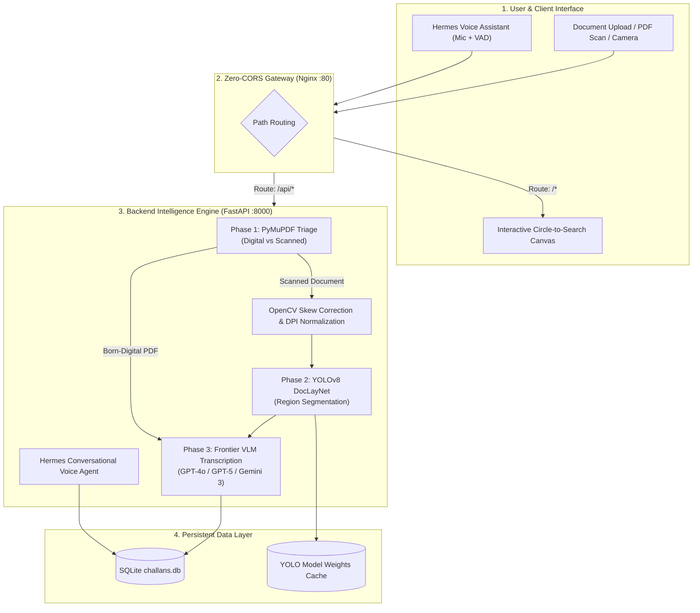

# 🔱 Trident — Intelligent Dual-Model OCR & Voice Assistant Pipeline

[](https://github.com/Prayag2439/Trident-OCR/actions/workflows/deploy.yml)
[](https://fastapi.tiangolo.com)
[](https://nextjs.org)
[](https://www.docker.com)
[](https://nginx.org)

**Trident** is an enterprise-grade document intelligence and challan management platform. It combines **computer vision (Ultralytics YOLOv8 DocLayNet)**, **frontier Vision-Language Models (GPT-4o/5 & Gemini 2.0/3.0)**, **Hermes real-time Voice Assistant**, and an interactive **"Circle to Search"** visual inspection canvas.

---

## 🌟 Key Features

- **⚡ Born-Digital Triage (Parse, Don't OCR)**: Native vector PDFs are triaged using **PyMuPDF (`fitz`)**. If extractable character count exceeds threshold ($\ge 12$), text and bounding coordinates are extracted instantly at 0 latency and 0 API cost.
- **🧠 Layout-Aware Block Extraction**: Scanned documents & images are rasterized to $\ge 200\text{ DPI}$ and passed through **Ultralytics YOLOv8 DocLayNet** to segment Header, Items, and Totals sections.
- **🔮 Dual-Model Vision Transcription**: Switch seamlessly in real-time between **OpenAI (GPT-4o / GPT-5)** and **Google (Gemini 2.0 / 3.0)**.
- **🎙️ Hermes Voice Assistant**: Continuous voice-driven form filling powered by Web Audio **Voice Activity Detection (VAD)** and conversational LLM reasoning.
- **🔍 "Circle to Search" Interactive Lens**: Hovering or selecting any extracted field illuminates a synchronized SVG spotlight lens with crosshair reticles over the original scanned document.
- **📊 Challan Manager & Excel Export**: Full SQLite persistence (`challans.db`), batch search, edit history, and one-click Excel (`.xlsx`) export matching standard e-way bill formats.
- **🛡️ 100% Zero-CORS Architecture**: Pre-configured Nginx single-origin gateway and dynamic FastAPI middleware that eliminate cross-origin and preflight errors.

---

## 🏗️ End-to-End System Workflow



---

## 📁 Repository Structure

```
Trident/
├── .env                       # Unified Environment configuration (Dev & Prod)
├── .gitignore                 # Filtered ignore list (Secrets, DBs, Caches)
├── Jenkinsfile                # Production Declarative CI/CD Pipeline
├── docker-compose.yml         # Multi-container orchestration (Zero-CORS Stack)
├── JENKINS_DEPLOYMENT_GUIDE.md# Master deployment & troubleshooting manual
├── README.md                  # Comprehensive documentation
│
├── backend/                   # FastAPI Backend (Python 3.11)
│   ├── main.py                # App entrypoint with dynamic CORS middleware
│   ├── config.py              # Pydantic Settings & single .env loader
│   ├── database.py            # SQLite connection manager & user auth seed
│   ├── requirements.txt       # Python dependencies (OpenCV, PyTorch, etc.)
│   ├── Dockerfile             # Multi-stage Python backend Dockerfile
│   ├── routers/               # API Routers (process, assistant, challans, auth)
│   ├── services/              # Pipeline Services (triage, layout, vlm, deskew, hermes)
│   └── models/                # Pydantic request/response schemas
│
├── frontend/                  # Next.js 14 Frontend (TypeScript + Tailwind)
│   ├── app/                   # App Router (page.tsx, layout.tsx, globals.css)
│   ├── components/            # React components (Dashboard, Lens, VoiceAssistant, etc.)
│   ├── hooks/                 # Custom hooks (useOCRPipeline.ts)
│   ├── utils/                 # API client with relative routing (api.ts)
│   ├── types/                 # OCR & Challan TypeScript definitions
│   └── Dockerfile             # Multi-stage Next.js production Dockerfile
│
├── nginx/                     # Nginx Reverse Proxy (Zero-CORS Gateway)
│   ├── nginx.conf             # 50MB uploads, 300s timeouts, preflight handling
│   └── Dockerfile             # Nginx Alpine container
│
└── .github/workflows/         # GitHub Actions CI/CD Automation
    └── deploy.yml             # Build verification, lint audit & smoke test
```

---

## ⚙️ Unified Environment Configuration (`.env`)

Trident uses a **single root `.env` file** that manages both local development and containerized production environments:

```env
# ── AI Providers ─────────────────────────────────────────────────────────────
OPENAI_API_KEY=ssk-proj-...
GOOGLE_API_KEY=AQ.Ab8RN6...

# ── Model Selection ─────────────────────────────────────────────────────────
OPENAI_MODEL=gpt-4o
GOOGLE_MODEL=gemini-2.0-flash

# ── Layout Detection ─────────────────────────────────────────────────────────
# Leave empty to auto-download yolov8x-doclaynet.pt on first run
LAYOUT_MODEL_PATH=

# ── Preprocessing Parameters ────────────────────────────────────────────────
MIN_DPI=200
TEXT_CHAR_THRESHOLD=12

# ── Zero-CORS Production Gateway ────────────────────────────────────────────
FRONTEND_ORIGIN=http://localhost:3000,http://localhost
NEXT_PUBLIC_API_URL=
NEXT_PUBLIC_BACKEND_URL=
```

---

## 🚀 Quick Start (Local Development)

### 1. Backend Setup (FastAPI)
```bash
cd backend
python -m venv .venv

# Windows:
.venv\Scripts\activate
# Linux/macOS:
# source .venv/bin/activate

pip install -r requirements.txt
uvicorn main:app --reload --port 8000
```
API Documentation will be live at: `http://localhost:8000/docs`

### 2. Frontend Setup (Next.js)
```bash
cd frontend
npm install
npm run dev
```
Open `http://localhost:3000` in your browser.

---

## 🚢 Production Deployment (Docker & Zero-CORS)

Deploy the full production stack with a single command:

```bash
docker compose up -d --build
```

### Deployed Services:
- 🌐 **Web Application**: `http://localhost/` (Port 80)
- 🔌 **Backend REST API**: `http://localhost/api/` (Port 80)
- 📚 **Swagger API Docs**: `http://localhost/docs` (Port 80)
- ⚡ **Direct Backend**: `http://localhost:8000/` (Port 8000)

---

## 🔄 Automated CI/CD Pipelines

### 1. Jenkins Declarative Pipeline (`Jenkinsfile`)
Includes 5 production deployment stages:
1. **Validate Environment**: Verifies Docker host, disk space, and repository dependencies.
2. **Code Lint & Audit**: Audits Python syntax and Next.js configs in parallel.
3. **Build Docker Stack**: Builds optimized images using BuildKit and parallel workers.
4. **Deploy Containers**: Performs zero-downtime container launch (`docker compose up -d`).
5. **Smoke Test & Zero-CORS Check**: Automated preflight and HTTP status assertions.

👉 **For complete Jenkins setup instructions, see [JENKINS_DEPLOYMENT_GUIDE.md](file:///d:/Wrok%20Main/Trident/JENKINS_DEPLOYMENT_GUIDE.md)**.

### 2. GitHub Actions Workflow (`.github/workflows/deploy.yml`)
Automatically triggers on push to `main` or pull requests to validate code syntax, build Docker containers, and test the Zero-CORS preflight handshake.

---

## 📡 REST API Contract

### Core Endpoints

| Method | Endpoint | Description |
| :--- | :--- | :--- |
| `POST` | `/api/v1/process-document` | Upload PDF/image for layout segmentation & VLM transcription |
| `POST` | `/api/v1/assistant/voice` | Stream audio blob for Hermes voice-driven form filling |
| `GET`  | `/api/v1/challans/` | Fetch all saved challans from SQLite |
| `POST` | `/api/v1/challans/` | Create or save a new challan |
| `PUT`  | `/api/v1/challans/{id}` | Update existing challan data |
| `DELETE` | `/api/v1/challans/{id}` | Delete a challan record |
| `POST` | `/api/v1/auth/login` | Authenticate user session |
| `GET`  | `/api/v1/health` | Healthcheck endpoint |

---

## 📄 License & Maintainers

Maintained for enterprise document intelligence workflows. Built with FastAPI, Next.js, and PyTorch.
