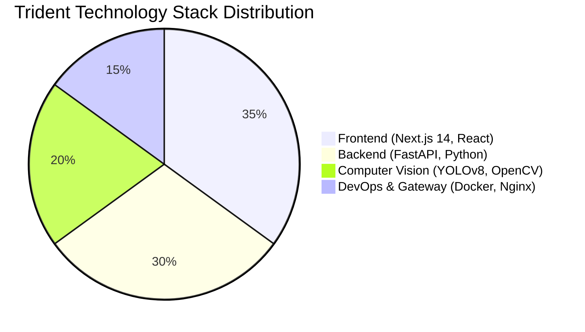
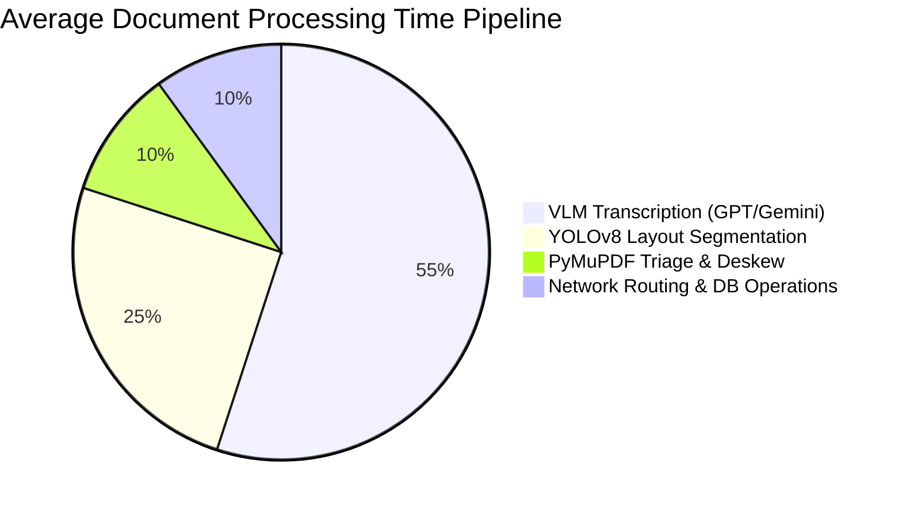
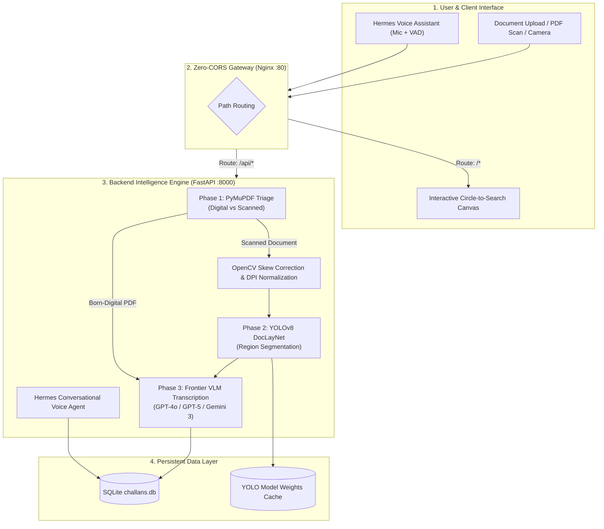
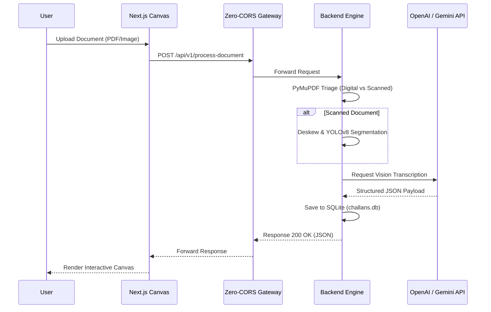

# 🔱 Trident — Intelligent Dual-Model OCR & Voice Assistant Pipeline

[](https://github.com/Prayag2439/Trident-OCR/actions/workflows/deploy.yml)
[](https://fastapi.tiangolo.com)
[](https://nextjs.org)
[](https://www.docker.com)
[](https://nginx.org)

**Trident** is a cutting-edge, enterprise-grade document intelligence and challan (invoice) management platform. It seamlessly orchestrates **advanced computer vision (Ultralytics YOLOv8 DocLayNet)**, **frontier Vision-Language Models (GPT-4o/5 & Gemini 2.0/3.0)**, the **Hermes real-time Voice Assistant**, and an intuitive **"Circle to Search"** visual inspection canvas to deliver unparalleled precision in data extraction and workflow automation.

---

## 🌟 Key Features & Capabilities

- **⚡ Born-Digital Triage (Parse, Don't OCR)**: Employs an intelligent triage mechanism using **PyMuPDF (`fitz`)**. If a native vector PDF exhibits an extractable character count surpassing the heuristic threshold ($\ge 12$), it bypasses heavy OCR to extract text and spatial bounding coordinates instantly, achieving zero latency and eliminating API costs.
- **🧠 Layout-Aware Region Segmentation**: Scanned documents and images are rasterized (normalized to $\ge 200\text{ DPI}$) and processed through our **Ultralytics YOLOv8 DocLayNet** pipeline. This isolates structural components such as Headers, Line Items, and Totals, preserving contextual integrity before transcription.
- **🔮 Dual-Model Vision Transcription (VLM)**: Provides real-time interoperability between industry-leading foundational models, including **OpenAI (GPT-4o / GPT-5)** and **Google (Gemini 2.0 / 3.0)**, ensuring resilient fallback and continuous operational availability.
- **🎙️ Hermes Voice Assistant**: Facilitates hands-free, continuous data entry via a Web Audio **Voice Activity Detection (VAD)** module, synergized with a conversational LLM reasoning engine for dynamic form auto-filling.
- **🔍 "Circle to Search" Interactive Lens**: An ergonomic UI feature where interacting with any extracted field summons a synchronized SVG spotlight lens, overlaying crosshair reticles directly onto the original scanned document for instant human-in-the-loop verification.
- **📊 Challan Manager & Excel Export**: Fully featured SQLite persistence layer (`challans.db`) providing batch search, audit trails, edit history, and one-click standard e-way bill Excel (`.xlsx`) exports.
- **🛡️ 100% Zero-CORS Architecture**: A robust pre-configured Nginx single-origin gateway coupled with dynamic FastAPI middleware explicitly engineered to eradicate cross-origin and preflight request bottlenecks.

---

## 📊 System Metrics & Architecture Breakdown

### Component Resource Allocation



### End-to-End Processing Latency Distribution



---

## 🏗️ End-to-End System Workflow



### Data Flow Sequence



---

## 📁 Repository Structure

```
Trident/
├── .env                       # Unified Environment configuration (Dev & Prod)
├── .gitignore                 # Filtered ignore list (Secrets, DBs, Caches)
├── Jenkinsfile                # Production Declarative CI/CD Pipeline
├── docker-compose.yml         # Multi-container orchestration (Zero-CORS Stack)
├── JENKINS_DEPLOYMENT_GUIDE.md# Master deployment & troubleshooting manual
├── README.md                  # Comprehensive documentation
│
├── backend/                   # FastAPI Backend (Python 3.11)
│   ├── main.py                # App entrypoint with dynamic CORS middleware
│   ├── config.py              # Pydantic Settings & single .env loader
│   ├── database.py            # SQLite connection manager & user auth seed
│   ├── requirements.txt       # Python dependencies (OpenCV, PyTorch, etc.)
│   ├── Dockerfile             # Multi-stage Python backend Dockerfile
│   ├── routers/               # API Routers (process, assistant, challans, auth)
│   ├── services/              # Pipeline Services (triage, layout, vlm, deskew, hermes)
│   └── models/                # Pydantic request/response schemas
│
├── frontend/                  # Next.js 14 Frontend (TypeScript + Tailwind)
│   ├── app/                   # App Router (page.tsx, layout.tsx, globals.css)
│   ├── components/            # React components (Dashboard, Lens, VoiceAssistant, etc.)
│   ├── hooks/                 # Custom hooks (useOCRPipeline.ts)
│   ├── utils/                 # API client with relative routing (api.ts)
│   ├── types/                 # OCR & Challan TypeScript definitions
│   └── Dockerfile             # Multi-stage Next.js production Dockerfile
│
├── nginx/                     # Nginx Reverse Proxy (Zero-CORS Gateway)
│   ├── nginx.conf             # 50MB uploads, 300s timeouts, preflight handling
│   └── Dockerfile             # Nginx Alpine container
│
└── .github/workflows/         # GitHub Actions CI/CD Automation
    └── deploy.yml             # Build verification, lint audit & smoke test
```

---

## ⚙️ Unified Environment Configuration (`.env`)

Trident uses a **single root `.env` file** that manages both local development and containerized production environments, guaranteeing configuration consistency across all deployment tiers:

```env
# ── AI Providers ─────────────────────────────────────────────────────────────
OPENAI_API_KEY=ssk-proj-...
GOOGLE_API_KEY=AQ.Ab8RN6...

# ── Model Selection ─────────────────────────────────────────────────────────
OPENAI_MODEL=gpt-4o
GOOGLE_MODEL=gemini-2.0-flash

# ── Layout Detection ─────────────────────────────────────────────────────────
# Leave empty to auto-download yolov8x-doclaynet.pt on first run
LAYOUT_MODEL_PATH=

# ── Preprocessing Parameters ────────────────────────────────────────────────
MIN_DPI=200
TEXT_CHAR_THRESHOLD=12

# ── Zero-CORS Production Gateway ────────────────────────────────────────────
FRONTEND_ORIGIN=http://localhost:3000,http://localhost
NEXT_PUBLIC_API_URL=
NEXT_PUBLIC_BACKEND_URL=
```

---

## 🚀 Quick Start (Local Development)

### 1. Backend Setup (FastAPI)
```bash
cd backend
python -m venv .venv

# Windows:
.venv\Scripts\activate
# Linux/macOS:
# source .venv/bin/activate

pip install -r requirements.txt
uvicorn main:app --reload --port 8000
```
Interactive API Documentation available at: `http://localhost:8000/docs`

### 2. Frontend Setup (Next.js)
```bash
cd frontend
npm install
npm run dev
```
Navigate to `http://localhost:3000` to launch the application interface.

---

## 🚢 Production Deployment (Docker & Zero-CORS)

Deploy the fully-containerized, production-grade stack with a single command:

```bash
docker compose up -d --build
```

### Deployed Services Stack:
- 🌐 **Web Application Interface**: `http://localhost/` (Port 80)
- 🔌 **Backend REST API Gateway**: `http://localhost/api/` (Port 80)
- 📚 **Interactive Swagger API Docs**: `http://localhost/docs` (Port 80)
- ⚡ **Direct Backend Service**: `http://localhost:8000/` (Port 8000)

---

## 🔄 Automated CI/CD Pipelines

### 1. Jenkins Declarative Pipeline (`Jenkinsfile`)
Includes five robust production deployment stages to guarantee stable releases:
1. **Validate Environment**: Verifies Docker daemon status, available disk space, and repository prerequisites.
2. **Code Lint & Audit**: Executes parallel syntax audits for Python backend and Next.js frontend environments.
3. **Build Docker Stack**: Orchestrates optimized multi-stage image builds using Docker BuildKit and parallel workers.
4. **Deploy Containers**: Executes seamless, zero-downtime container spin-up (`docker compose up -d`).
5. **Smoke Test & Zero-CORS Check**: Conducts automated HTTP status assertions and preflight verification checks.

👉 **For comprehensive Jenkins configuration, refer to the [JENKINS_DEPLOYMENT_GUIDE.md](file:///d:/Wrok%20Main/Trident/JENKINS_DEPLOYMENT_GUIDE.md)**.

### 2. GitHub Actions Workflow (`.github/workflows/deploy.yml`)
Automatically triggered upon pushing to the `main` branch or generating pull requests. It rigorously validates code syntax, compiles Docker containers, and executes the Zero-CORS preflight handshake test to maintain robust code hygiene.

---

## 📡 REST API Contract

### Core Endpoints Matrix

| HTTP Method | Endpoint | Functional Description |
| :--- | :--- | :--- |
| `POST` | `/api/v1/process-document` | Submits PDF/image for layout segmentation & synchronous VLM transcription |
| `POST` | `/api/v1/assistant/voice` | Streams audio blob for Hermes continuous voice-driven form data entry |
| `GET`  | `/api/v1/challans/` | Retrieves the full ledger of saved challans from the SQLite data layer |
| `POST` | `/api/v1/challans/` | Instantiates and persists a new challan record |
| `PUT`  | `/api/v1/challans/{id}` | Updates existing challan metadata and transaction states |
| `DELETE` | `/api/v1/challans/{id}` | Purges a specific challan record from the database |
| `POST` | `/api/v1/auth/login` | Authenticates and provisions user session tokens |
| `GET`  | `/api/v1/health` | Emits system healthcheck diagnostics |

---

## 📄 License & Maintainers

Architected for enterprise document intelligence workflows. Powered by **FastAPI**, **Next.js**, and **PyTorch**.